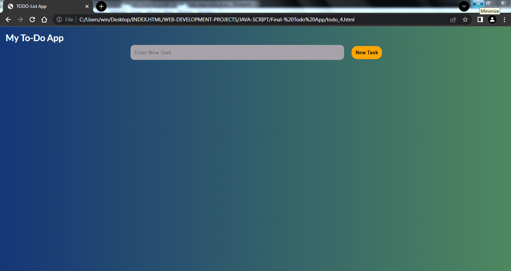
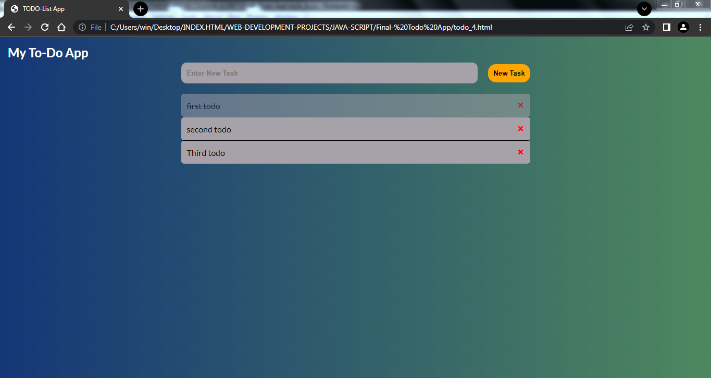
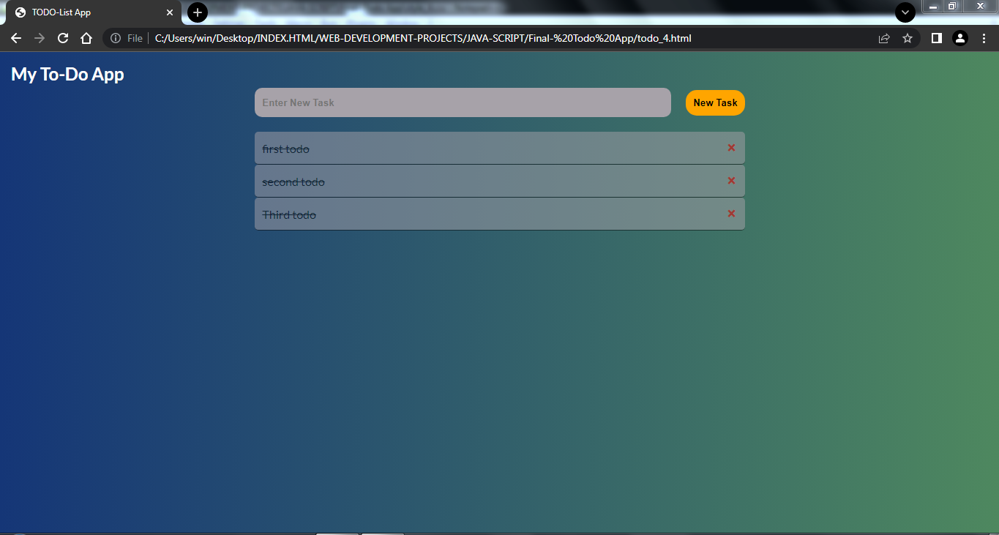

# 📝 Todo App (Vanilla JS)

A simple **Todo List App** built using **HTML, CSS, and JavaScript**.  
This project lets you add, mark complete, and delete tasks. It also saves tasks in **LocalStorage**, so your data won’t disappear after refreshing the page.

---

## 🚀 Features
- ➕ Add new tasks  
- ✅ Mark tasks as completed (line-through & opacity)  
- ❌ Delete tasks  
- 💾 Data saved in **LocalStorage**  
- 🎨 Clean UI with responsive design  

---

## 📂 Project Structure
```
📁 Todo-App
 ┣ 📜 index.html    # Main HTML file
 ┣ 📜 style_4.css   # Styles for the app
 ┣ 📜 script.js     # JavaScript logic
 ┗ 📜 README.md     # Project documentation
```

---

## ⚡ How It Works
1. Type your task in the input box.  
2. Click **New Task** to add it to the list.  
3. Click on a task to **toggle completion**.  
4. Click the ❌ button to **delete a task**.  
5. All changes are **saved automatically** in your browser’s LocalStorage.

---

## 🖼️ Demo Screenshot



 

---

## Live Demo
[Click here to try it live](https://divyansh-redoc.github.io/Todo-List-App-/)

---

## 💡 Future Improvements
- Edit existing tasks  
- Add due dates & categories  
- Improve responsive design  
- Dark/Light mode toggle  

---

## 🛠️ Tech Stack
- **HTML5**
- **CSS3**
- **Vanilla JavaScript (ES6+)**
- **LocalStorage API**

---

✨ Built with ❤️ by [ivayansh Jha
